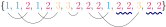

# 169. Majority Element

Given an array `nums` of size $n$, return *the majority element*.

The majority element is the element that appears more than $\frac{n}{2}$ times. You may assume that the majority element always exists in the array.

Could you solve the problem in linear time and in $O(1)$ space?

 
**Example:**

> **Input:** <code>nums = [<font color="#0085C9">1</font>, <font color="#0085C9">1</font>, <font color="#CC0548">2</font>, <font color="#0085C9">1</font>, <font color="#CC0548">2</font>, <font color="#FFC03F">3</font>, <font color="#FFC03F">3</font>, <font color="#CC0548">2</font>, <font color="#CC0548">2</font>, <font color="#CC0548">2</font>, <font color="#0085C9">1</font>, <font color="#CC0548">2</font>, <font color="#CC0548">2</font>, <font color="#FFC03F">3</font>, <font color="#CC0548">2</font>, <font color="#CC0548">2</font>]</code>
> 
> **Output:** <code><font color="#CC0548">2</font></code>


## Boyer-Moore majority vote algorithm

It's very easy if we use a hashmap, but the $O(1)$ space is very difficult. It's not hard to come up a rough idea like, use some temporary vars. to store the #. of appearances of the current majority number so far, and if we see a more "major" one, replace it with the new one. But implementation details are not easy to figure out.

Boyer and Moore ([1981](https://dx.doi.org/10.1007/978-94-011-3488-0_5)) proposed an algo. to do this.[^citation] We visualise the above example in the graph below.[^wikipedia] The $y$-axis plots the #. of "appearance" of the current majority number so far, the $x$-axis is the numbers in `nums`, and the symbol on the line marks the current majority number so far.

[^citation]: Boyer, Robert S., and J. Strother Moore. 1981. "MJRTY—A Fast Majority Vote Algorithm." In *Automated Reasoning: Essays in Honor of Woody Bledsoe*, edited by Robert S. Boyer, 105--17. Dordrecht: Springer.

[^wikipedia]: The graph is from [Wikipedia](https://en.wikipedia.org/wiki/File:Boyer-Moore_MJRTY.svg).


<center></center>

It works as follows:

1. let $majority = nums_0$ and $appearance = 1$
1. traverse through $nums$ from the first element onwards
    * if $appearance = 0$, assign $majority = nums_i$ and $appearance = 1$
    * else if $majority = nums_i$, $appearance += 1$
    * else $appearance -= 1$
1. return $majority$

**Lemma.** It's possible to partition $\{nums\}_i$ into $c\geq 0$ $x$’s ($\mathbf{U}$) and $\dfrac{n - c}{2}$ pairs of different $\{u, v\}$’s where $u\neq v$ and $u, v\in \{nums\}_i$ ($\mathbf{P}$).

**Proof of Lemma.** The intuition is we can pair as many two different numbers as possible, and after all the pairing we still have some duplicate numbers remaining, which is the majority. To see this, the above example can be paired as:

<center></center>

We can prove the existence of such partition by induction on the sequence length $n$. For simplicity, here we assume the sequence is one-indexed.

When $n = 1$, we have one number only, so trivially $\mathbf{U}_1 = \{1\}$, $\mathbf{P}_1 = \varnothing$, $x_1 = nums_1$, and $c_1 = 1$.

Assume the lemma holds for $n \leq i \in \mathbb{N}^+$, and we have $\mathbf{U}_i = \{\underset{c_i\text{ times}}{\underbrace{x_i, \ldots, x_i}}\}$ and $\mathbf{P}_i$. Now we consider $n = i + 1$, and the last element is $nums_{i + 1}$.

* if $nums_{i + 1} = x_i$, then we have one more element of $x$ and can append it into $\mathbf{U}$. Nothing else changes, so $\mathbf{U}_{i + 1} = \{\underset{c_i + 1\text{ times}}{\underbrace{x_i, \ldots, x_i, nums_{i + 1}}}\}$, $\mathbf{P}_{i + 1} = \mathbf{P}_i$, and $x_{i + 1} = x_i$. The partition exists
* if $nums_{i + 1}\neq x$
    * if $c\geq 1$, then we can take one $x$ out from $\mathbf{U}_i$ and pair it with $nums_{i + 1}$. By doing this, we lose one $x$’s and have one more pair of different numbers $\{x, nums_{i + 1}\}$. This translates to $\mathbf{P}_{i + 1} = \mathbf{P}_i \cup \{x, nums_{i + 1}\}$, $\mathbf{U}_{i + 1} = \varnothing$, and $x_{i + 1} = x_i$. The partition exists
    * if $c = 0$, then $\mathbf{U}_i = \varnothing$. $nums_{i + 1}$ itself will be the only element in the new $\mathbf{U}_{i + 1}$ and $\mathbf{P}$ doesn't change. So $\mathbf{U}_{i + 1} = \{nums_{i + 1}\}$, $\mathbf{P}_{i + 1} = \mathbf{P}_i$, and $x_{i + 1} = nums_{i + 1}$. The partition exists

By induction, this holds for all $n\in \mathbb{N}^+$. $\blacksquare$

**Proof.** By the lemma above, we have $c$ $x$’s and $\dfrac{n - c}{2}$ pairs of different numbers. In $\mathbf{P}$, a same number has at most $\dfrac{n - c}{2}$ appearances as the two numbers within a pair are different, and its appearances $\dfrac{n - c}{2} < \dfrac{n}{2}$, so it cannot be majority. Therefore, any number in $\mathbf{P}$ is not majority. But by assumption we know a majority exists, so it must be the $x$ in $\mathbf{U}$. $\blacksquare$

**Notes.** The correctness of the algo. does depend on the existence of majority and is **not always** correct! If there is no majority, the return value of this algo. is meaningless, e.g. for $\{1, 1, 2, 2, 3\}$ it returns $3$.


### Implementation

```cpp
int majorityElement(vector<int>& nums) {
    int ans = nums[0];
    int appearance = 1;

    int n_nums = nums.size();
    for (int i = 1; i < n_nums; i++) {
        if (appearance == 0) {
            ans = nums[i];
            appearance = 1;
        } else if (nums[i] == ans) {
            appearance++;
        } else {
            appearance--;
        }
    }
    return ans;
}
```
