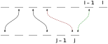

# 1143. Longest Common Subsequence

Given two strings `text1` and `text2`, return *the length of their longest __common subsequence__*. If there is no common subsequence, return `0`.

A **subsequence** of a string is a new string generated from the original string with some characters (can be none) deleted without changing the relative order of the remaining characters.

* for example, `"ace"` is a subsequence of `"abcde"`.

A **common subsequence** of two strings is a subsequence that is common to both strings.

 
**Example:**

> **Input:** `text1 = "abcde"`, `text2 = "ace"`
> 
> **Output:** `3`
> 
> **Explanation:** The longest common subsequence is `"ace"` and its length is $3$.


## DP

It feels we can solve this problem by DP: a longer common subsequence can build on top of a previous shorter common subsequence. Let $dp(i, j)$ be the length of longest common subsequence when we consider the first $i$ chars. in `text1` and first $j$ chars. in `text2`. For simplicity, $i$ and $j$ are inclusive.[^inclusive indexing]

[^inclusive indexing]: That is, we consider `text1[0:i + 1]` and `text2[0:j + 1]`.

* base case:
    + $dp(0, j) = \mathbb{1}($`text1[0] in text2[0:j + 1]`$)$, i.e. if we consider the first char. in `text1`, then if it's in the first $j$ chars. in `text2`, then we have a length-$1$ common subsequence
    + $dp(i, 0) = \mathbb{1}($`text2[0] in text1[0:i + 1]`$)$
* recurrence relation:

    $$
    dp(i, j) = \begin{cases}
        dp(i - 1, j - 1) + 1, &\text{if }\texttt{text1[i] == text2[j]}\\
        \max \big (dp(i - 1, j), dp(i, j - 1)\big ), &\text{if }\texttt{text1[i] != text2[j]}
    \end{cases}
    $$

**Sketch of Proof of Recurrence Relation and Optimal Substructure.** The recurrence relation above is not obvious at all. Here we show, at some superficial level, why the recurrence relation is correct and that problem has optimal substructure. The trivial case is that `text1[i] == text2[j]`. In this case $dp(i, j) = dp(i - 1, j - 1) + 1$.



A more complicated case is when `text1[i] != text2[j]`. Let's focus on `text2[j]`, as the case of `text1` is symmetric. There are three possibilities for `text2[j]`:

1. it cannot be matched with any char. in `text1[:i + 1]`, so a candidate $dp(i, j)$ is $dp(i, j - 1)$ as `text2[j]` contributes nothing. $dp(i, j - 1)$ is an always-possible candidate: we won't do any worse than it
1. it can be matched to <code><font color="#008000">text1[i - 1]</font></code>, so a candidate $dp(i, j)$ is then $dp(i - 1, j)$, bc. the final matched chars. are <code><font color="#008000">text1[i - 1]</font></code> and `text2[j]`
1. it can be matched to <font color="#800000">a char. before <code>text1[i - 1]</code></font>; call it <code><font color="#800000">text1[k]</font></code>. Then a candidate $dp(i, j)$ is $dp(k, j), k < i - 1$

Similarly, when we consider the possibilities for `text1[i]`, the always-possible candidate is $dp(i - 1, j)$, and some other (not-always) possibilities $dp(j - 1, i)$ and $dp(i, l), l < j - 1$. Observe that $dp(\cdot, \cdot)$ is non-decreasing in both independent vars., bc. we can always ignore new chars. so new chars. won't decrease $dp$.[^easier proof] As a result, $dp(k, j)\leq dp(i - 1, j)$, i.e. this not-always-possible candidate is (weakly) dominated by the always-possible candidate. The same holds for $dp(i, l)\leq dp(i, j - 1)$. So in the end, the max. $dp(i, j)$ will come from the larger of the two always-possible candidates $dp(i - 1, j)$ and $dp(i, j - 1)$. Now the optimal substructure follows naturally: if $dp(i, j)$ is the sol., then $dp(i - 1, j - 1)$ or $dp(i, j - 1)$ or $dp(i - 1, j)$ shall also be the sol. to the corresponding subproblem. Otherwise, we can get a larger or smaller $dp(i, j)$. $\blacksquare$

[^easier proof]: An easier proof builds directly on the weak monotonicity of $dp$. I don't care which char. is `text2[j]` matched to. As long as the match is before `text1[i - 1]`, it contributes to some $dp(k, j), k < i - 1$. And our $dp(i - 1, j)$ will capture this match already as $k$ is before $j - 1$.


### Bottom-up

```c
int longestCommonSubsequence(char* text1, char* text2) {
    int n = strlen(text1);
    int m = strlen(text2);
    int dp[n][m];

    // Base case
    dp[0][0] = (text1[0] == text2[0]) ? 1 : 0;
    bool matched = false;
    for (int i = 0; i < n; i++) {  // dp(i, 0)
        if (matched) {
            dp[i][0] = 1;
        } else {
            if (text1[i] == text2[0]) {
                matched = true;
                dp[i][0] = 1;
            } else {
                dp[i][0] = 0;
            }
        }
    }
    matched = false;
    for (int j = 0; j < m; j++) {  // dp(0, j)
        if (matched) {
            dp[0][j] = 1;
        } else {
            if (text1[0] == text2[j]) {
                matched = true;
                dp[0][j] = 1;
            } else {
                dp[0][j] = 0;
            }
        }
    }

    // Recurrence
    for (int i = 1; i < n; i++) {
        for (int j = 1; j < m; j++) {
            // text1[i] == text2[j]
            if (text1[i] == text2[j]) {
                dp[i][j] = dp[i - 1][j - 1] + 1;

            // text1[i] != text2[j]
            } else {
                dp[i][j] = (dp[i - 1][j] > dp[i][j - 1]) ?
                           dp[i - 1][j] : dp[i][j - 1];
            }
        }
    }
    return dp[n - 1][m - 1];
}
```
