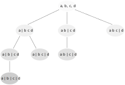
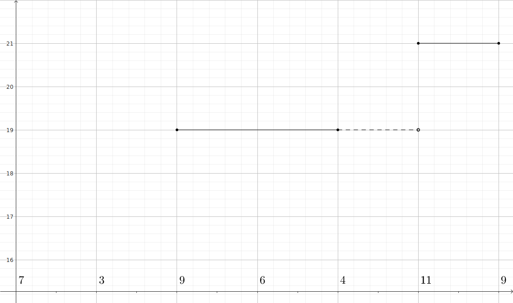

# 1335. Minimum Difficulty of a Job Schedule

You want to schedule a list of jobs in `d` days. Jobs are dependent (i.e, to work on the $i$<sup>th</sup> job, you have to finish all the jobs $j$ where $0 \leq j < i$).

You have to finish **at least** one task every day. The difficulty of a job schedule is the sum of difficulties of each day of the d days. The difficulty of a day is the maximum difficulty of a job done on that day.

You are given an integer array `jobDifficulty` and an integer `d`. The difficulty of the $i$<sup>th</sup> job is `jobDifficulty[i]`.

Return *the minimum difficulty of a job schedule*. If you cannot find a schedule for the jobs return `-1`.

**Example:**

> **Input:** `jobDifficulty = [7, 3, 9, 6, 4, 2, 9]`, `d = 3`
> 
> **Output:** `19`
> 
> **Explanation:** First day you can finish the first job, total difficulty = $7$.
>
> Second day you can finish the second job, total difficulty = $3$.
>
> Second day you can finish all other jobs, total difficulty = $9$.
> 
> The difficulty of the schedule $= 7 + 3 + 9 = 19$.


## Recursion/top-down DP/DFS/brute force

The problem is effectively splitting an array into several segments, and try to minimise the sum of the maximum elements in each segment. To brute force it, we try all possible splits:

$[\underset{7}{\underbrace{7}}|\underset{3}{\underbrace{3}}|\ \underset{9}{\underbrace{9\ 6\ 4\ 2\ 9}}], [\underset{7}{\underbrace{7}}|\ \underset{9}{\underbrace{3\ 9}}\ |\ \underset{9}{\underbrace{6\ 4\ 2\ 9}}], [\underset{7}{\underbrace{7}}|\ \underset{9}{\underbrace{3\ 9\ 6}}\ |\ \underset{9}{\underbrace{4\ 2\ 9}}], \ldots, [\underset{9}{\underbrace{7\ 3\ 9\ 6\ 4}}\ |\underset{2}{\underbrace{2}}|\underset{9}{\underbrace{9}}]$

However, the #. of nested loops is equal to the #. of splits/days. Without knowing this beforehand, it's hard to write the code.[^nested loops] E.g. we may want `for i in xxx: for j in yyy` if we have two days, and want `for i in xxx: for j in yyy: for k in zzz` if we have three days. One solution is divide and conquer: we recursively split jobs into jobs to do today and jobs to be done later. To fix notation, let $dfs(i, d)$ be the optimal job difficulty when we have $d$ days remaining and have to finish all jobs from the $i$<sup>th</sup> onwards.

[^nested loops]: If you really want, you can. See [https://stackoverflow.com/q/64573917](https://stackoverflow.com/q/64573917).

* base case: $\displaystyle dfs(i, 1) = \max_{j\geq i} jobDifficulty_j$, i.e. when we only have one day left, we have to finish all remaining jobs, and the job difficulty for that day is the maximum difficulty of all remaining jobs
* recurrence relation: $\displaystyle dfs(i, d) = \max_{i\leq j\leq n_{jobs} - d} jobDifficulty_j + \min_{i\leq j\leq n_{jobs} - d} dfs(j + 1, d - 1)$. That is, we have $d$ days left, and have to finish the $i$<sup>th</sup> job to the last job. Let's split the jobs into $i$<sup>th</sup> to $j$<sup>th</sup> job, and $j$<sup>th</sup> to the last job, and we do $i$<sup>th</sup> to $j$<sup>th</sup> job today, and do the remaining later. Today's job difficulty is the max. difficulty of $i$<sup>th</sup> to $j$<sup>th</sup> job, and the optimal job difficulty for the rest of days is $dfs(j, d - 1)$. We try all possible $j$’s and find the lowest job difficulty. Please note the upper bound of $j$ is #. of jobs minus days remaining. That is, if we have four days remaining, we must have at least four jobs untouched, so that all days can have at least one job scheduled, which is a requirement of this problem.


### Implementation

```c
int dfs(int* jobDifficulty, int jobDifficultySize,
        int start_job_idx, int days_remaining, int** dfs_cache) {
    // Check if the current DFS has already been computed in previous calls
    if (dfs_cache[start_job_idx][days_remaining] > INT_MIN) {
        return dfs_cache[start_job_idx][days_remaining];
    }

    // If only one day is left, have to finish all jobs today
    int min_diff = INT_MIN;
    if (days_remaining == 1) {
        for (int i = start_job_idx; i < jobDifficultySize; i++) {
            if (jobDifficulty[i] > min_diff) {
                min_diff = jobDifficulty[i];
            }
        }
        dfs_cache[start_job_idx][days_remaining] = min_diff;
        return min_diff;
    }

    // If we have two or more days left, split all jobs into jobs to be done
    // today and jobs for tomorrow or later. Loop over all possible choices
    // for today's last job
    int today_diff = INT_MIN;
    int future_diff;
    min_diff = INT_MAX;
    for (int i = start_job_idx;
         i < jobDifficultySize - days_remaining + 1;
         i++) {
        if (jobDifficulty[i] > today_diff) {
            today_diff = jobDifficulty[i];
        }
        future_diff = dfs(jobDifficulty, jobDifficultySize,
                          i + 1, days_remaining - 1, dfs_cache);
        if (future_diff + today_diff < min_diff) {
            min_diff = future_diff + today_diff;
        }
    }
    dfs_cache[start_job_idx][days_remaining] = min_diff;
    return min_diff;
}

int minDifficulty(int* jobDifficulty, int jobDifficultySize, int d) {
    // #. of job shall be greater than #. of day. Otherwise, some days will get
    // zero job and such schedule is not valid
    if (d > jobDifficultySize) {
        return -1;
    }

    // Init. DFS cache
    int** dfs_cache = malloc(jobDifficultySize * sizeof(*dfs_cache));
    for (int i = 0; i < jobDifficultySize; i++) {
        dfs_cache[i] = malloc((d + 1) * sizeof(*dfs_cache[i]));
        for (int j = 0; j < d + 1; j++) {
            dfs_cache[i][j] = INT_MIN;
        }
    }

    // Start with the first job, with d days remaining
    int ans = dfs(jobDifficulty, jobDifficultySize, 0, d, dfs_cache);
    free(dfs_cache);
    return ans;
}
```

We shall cache all `dfs` calls' results and reuse them if possible. Otherwise will lose a lot of time. E.g. $[7\ |\ 3\ 9\ |\ 6\ 4\ 2\ 9]$ and $[7\ 3\ |\ 9\ |\ 6\ 4\ 2\ 9]$ both use `dfs(3, 1)`, so we only have to calc. this once.

The time complexity is $O(n^2d)$, since for each day, we run a nested loop over all jobs.


### How is this recursion related to DFS?[^dp to tree]

[^dp to tree]: [https://leetcode.com/problems/minimum-difficulty-of-a-job-schedule/solutions/924611/dfs-dp-progression-with-explanation-o-n-3d-o-nd](https://leetcode.com/problems/minimum-difficulty-of-a-job-schedule/solutions/924611/dfs-dp-progression-with-explanation-o-n-3d-o-nd).

(We don't have to think this as a DFS; simply treating this as a DP is totally fine.)

Tree is a very good way to visualise all possible splitting:



So if we have three days, then we DFS to nodes with depth $2$ and get the node with smallest difficulty. But again, no need to think this as a tree.


## Bottom-Up DP

We can also do a bottom up DP, i.e. iteratively, without recursion. Again, let $dp(i, d)$ be the solution when we have $d$ days left and have to finish all jobs from $i$<sup>th</sup> onwards. Recall:

* base case: $\displaystyle dp(i, 1) = \max_{j\geq i} jobDifficulty_j$
    + if only one day left, finish all unfinished jobs
* recurrence relation: $\displaystyle dp(i, d) = \max_{i\leq j\leq n - d} jobDifficulty_j + \min_{i\leq j\leq n - d}dp(j + 1, d - 1)$
    + split unfinished jobs into $[i, i + 1, \ldots, j]$ (jobs to be done today) and $[j + 1, j + 2, \ldots, n]$ (jobs for tomorrow and later). Find $j$ that gives us best difficulty

So for given $d$ and $i$, to get $dp(i, d)$, we loop over all possible $j$’s and solve the optimisation problem in the above recurrence relation. However, RHS has $dp(\cdot, d - 1)$, which further requires us to solve $dp(\cdot, d - 2)$, and then $dp(\cdot, d - 3)$, ..., all the way up to $dp(\cdot, 1)$, which is the base case: finish all remaining jobs today. In the top-down DP, we recursively call $dfs$ to get those RHS terms. Here the bottom-up way is to loop over $d$ from $1$ to $d$ to get the RHS terms first and then compute the $dp$ for the next day.

### Implementation

```c
int minDifficulty(int* jobDifficulty, int jobDifficultySize, int d) {
    // If more days than #. of jobs, then no valid schedule
    if (d > jobDifficultySize) {
        return -1;
    }

    // Init. DP[i][d]: when have d days left and have to do i-th job to the end
    int dp[jobDifficultySize][d + 1];  // See notes below
    int today_diff;
    for (int i = 0; i < jobDifficultySize; i++) {
        today_diff = INT_MIN;
        for (int j = i; j < jobDifficultySize; j++) {
            if (jobDifficulty[j] > today_diff) {
                today_diff = jobDifficulty[j];
            }
        }
        dp[i][1] = today_diff;
        for (int days_left = 2; days_left <= d; days_left++) {
            dp[i][days_left] = INT_MAX;
        }
    }

    // Bottom-up DP, from when we have two days to when we have `d` days
    int future_diff;
    for (int days_left = 2; days_left <= d; days_left++) {

        // Jobs from i-th onwards remains to be done. Loop over `i`
        for (int i = 0; i <= jobDifficultySize - days_left; i++) {
            today_diff = INT_MIN;

            // Split remaining jobs into [i to j] and (j to end]
            for (int j = i; j <= jobDifficultySize - days_left; j++) {

                // Max. job diff. today
                if (jobDifficulty[j] > today_diff) {
                    today_diff = jobDifficulty[j];
                }

                // Min. job diff. for later days
                future_diff = dp[j + 1][days_left - 1];

                // Recurrence relation
                if (today_diff + future_diff < dp[i][days_left]) {
                    dp[i][days_left] = today_diff + future_diff;
                }
            }

            // See notes
            if ((i == 0) && (days_left == d)) {
                return dp[0][d];
            }
        }

    }
    return dp[0][d];
}
```

We are not clear about lots of boundaries, both in the first DFS approach and this bottom-up DP approach. The notes below clarify all of them.

**What's the Size of $\boldsymbol{dp}$?** $dp(i, d)$ is the optimal solution when we have $d$ days left and have to do $i$<sup>th</sup> job towards the end. So $i\in [0, jobDifficultySize)$, and $d\in [1, \text{total #. of days}]$.[^d] So `dp` shall have a height of `jobDifficultySize` and a width of `d`. But as $d$ starts from $1$, and the array is zero-indexed, so for coding simplicity, we increase the width to `d + 1`, and will never use the zero<sup>th</sup> col.

[^d]: Sorry we accidentally mix the notations here... `d` is the total #. of days, and $d$ in $dp(\cdot, d)$ is days left.

**How to Deal with the Base Case?** First of all, $d\geq 1$, so we don't need to care about `dp[i][0]`; leave the zero<sup>th</sup> col. untouched. Then for the actual base case `dp[i][1]`, we manually set them to be the max. of job difficulty among jobs from $i$<sup>th</sup> onwards. For all other cells, set them to `INT_MAX` so we can do comparison in the loop easily.

**Early Stop.** This is not necessary but makes the code slightly faster. We don't need to solve all $dp(i, d)$’s. Specifically, the final answer is `dp[0][d]`, so when we reach `d` in `for (int days_left = 2; days_left <= d; days_left++)`, we only need to solve the case when `i = 0`. Put differently, we don't need all of `for (int i = 0; i <= jobDifficultySize - days_left; i++)`, only need `int i = 0`.

**Why Bottom-Up?** The time complexity here is still $O(n^2d)$, same as above. In principle, bottom-up DP runs everything iteratively, so it avoids the overheads in recursive calls in top-down DP, i.e. the constant term in time complexity may be smaller. But in practice, this actually does not boost the performance much, especially when we enable memorisation in the top-down DP.


## Bottom-up DP with monotonic stack

(It's literally impossible to come up with this sol...)

Both DPs above focus on future: for the remaining jobs, split them to today or later. However, for this solution, we have to focus on the past: so far I've finished $i - 1$ jobs, and now I have one additional new job $i$. What's the best way to do it?. To fix notation, let $dp(i, d)$ be the optimal difficulty when we have $d$ days in total and have to do the first $i$ jobs in the $d$ days. We have:

* base case: $\displaystyle dp(i, 1) = \max_{0\leq u\leq i} jobDifficulty_u$. When we have one day only, do all $i$ jobs today
* recurrence relation:

$$
dp(i, d) = \min \left \{ \begin{array}{ll}
           dp(i - 1, d - 1) + diff_i, & \text{naïve case}\\
           dp(j, d) + diff_i - diff_j, & \text{most difficult job } j\text{ in the previous last split is easier than }i\\
           dp(k, d) & \text{most difficult job } k\text{ in the previous last split is more difficult than }i
        \end{array}\right \}
$$

The recurrence relation is extremely difficult to understand (and actually not super mathematically correct). We illustrate it using an example below.


### Illustration

Suppose the above DP is correct. Now the problem is, how can we know which job is the most difficult one in the last split of $dp(j, 3)$? Use monotonic decreasing stack! To illustrate how we solve finishing `[7, 3, 9, 6, 4, 11, 9]` in three days, we show the algo. step by step.

1. the starting point is $dp(2, 3) = \underline{7}, \underline{3}, \underline{\color{red}{9}}$, and we push the index of $\color{red}{9}$ onto the stack: `stack = [2 (9)]`
1. to solve $dp(3, 3)$, we either
    + pick the naïve candidate $dp(2, 2) + 6 = \underline{7\ 3}, \underline{9}, \underline{\color{red}{6}}$, or
    + check the jobs in stack. Those jobs are possible $j$’s
        - here we have $2$<sup>nd</sup> job of difficulty $9$ in stack. $9$ is greater than $jobDifficulty_i = 6$, so it's the third case. Append $\color{red}{6}$ to the end of $dp(2, 3)$, which is $\underline{7}, \underline{3}, \underline{9\ \color{red}{6}}$, and this is still equal to $dp(2, 3) = 19$
    + the optimal is $\underline{7}, \underline{3}, \underline{9\ 6} = 19$
    + push the index of the current job $6$ to the stack: `stack = [2 (9), 3 (6)]`
1. to solve $dp(4, 3)$, again either
    + pick the naïve candidate $dp(3, 2) + 4 = \underline{7\ 3\ 9}, \underline{6}, \underline{\color{red}{4}}$, or
    + check the jobs in stack. Those jobs are possible $j$’s
        - the last job in stack is the $3$<sup>rd</sup> job of difficulty $6$. $6$ is greater than $jobDifficulty_i = 4$, so it's the third case. Append $\color{red}{4}$ to the end of $dp(3, 3)$, which is $\underline{7}, \underline{3}, \underline{9\ 6\ \color{red}{4}}$, and this is still equal to $dp(3, 3) = 19$
    + the optimal is $\underline{7}, \underline{3}, \underline{9\ 6\ 4} = 19$
    + push the index of the current job $4$ to the stack: `stack = [2 (9), 3 (6), 4 (4)]`
1. to solve $dp(5, 3)$, we either
    + pick the naïve candidate $dp(4, 2) + 11 = \underline{7\ 3\ 9\ 6}, \underline{4}, \underline{\color{red}{11}}$, or
    + check the jobs in stack. Those jobs are possible $j$’s
        - the last job in stack is the $4$<sup>th</sup> job of difficulty $4$. $4$ is smaller than $jobDifficulty_i = 11$, so it's the second case. Pop `4 (4)`
        - the last job in stack now becomes the $3$<sup>rd</sup> job of difficulty $6$, which is still smaller than the current $jobDifficulty_i = 11$, so still the second case. Pop `3 (6)`
        - the last job in stack now becomes the $2$<sup>nd</sup> job of difficulty $9$, which is still smaller than the current $jobDifficulty_i = 11$, so still the second case. Pop `2 (9)`
        - now the stack is empty, so we are sure that $9$ is the max. difficulty in the last split in $dp(4, 3)$. Append the current job $11$ to the last split, we get the new split $\underline{7}, \underline{3}, \underline{9\ 6\ 4\ \color{red}{11}}$. And our candidate $dp(5, 3) = dp(4, 3) + 11 - 9 = 19 + 11 - 9 = 21$
    + the optimal is $\underline{7}, \underline{3}, \underline{9\ 6\ 4\ \color{red}{11}} = 21$
    + push the current job to the stack: `stack = [5 (11)]`
1. to solve our final $dp(6, 3)$,
    + the naïve candidate is $dp(5, 2) + 9 = \underline{7}, \underline{3\ 9\ 6\ 4\ 11}, \underline{\color{red}9}$
    + check the jobs in stack. We have only one job
        - the last and only job in stack is the $5$<sup>th</sup> job of difficulty $11$, and it's larger than the current $jobDifficulty_i = 9$, so third case. The split is $dp(6, 3) = \underline{7}, \underline{3}, \underline{9\ 6\ 4\ 11\ \color{red}{9}} = dp(5, 3) = 21$

**Where Do We Get $dp(i - 1, d - 1)$.** Bc. sometimes the naïve candidate can be optimal (e.g. `jobDifficulty = [5, 4, 3, 2]` and `d = 2`), so we need $dp(i - 1, d - 1)$, which may further requires $dp(i - 1, d - 2)$, ... So we have to solve $dp(i, d)\ \forall d \geq 1$.


### Proof of sketch of the recurrence relation

It seems we come up with the three candidates very casually (indeed... I copied them from lee215's [solution](https://leetcode.com/problems/minimum-difficulty-of-a-job-schedule/solutions/490316/java-c-python3-dp-o-nd-solution)): will there be another case with even smaller difficulty? The answer is no: the three candidates do cover the optimal split. We now motivate this recurrence relation from the very basics:[^other ways to see this]

[^other ways to see this]: I see the DP here as what to do with one additional job. Many people see this as a way to decide $j$’s in the bottom-up DP above without having to check for all $j$’s. I personally cannot understand those explanation... See [https://leetcode.com/problems/minimum-difficulty-of-a-job-schedule/solutions/490316/java-c-python3-dp-o-nd-solution/comments/831422](https://leetcode.com/problems/minimum-difficulty-of-a-job-schedule/solutions/490316/java-c-python3-dp-o-nd-solution/comments/831422) and [https://leetcode.com/problems/minimum-difficulty-of-a-job-schedule/solutions/963963/java-top-down-and-bottom-up-dp-monotonic-stack-time-o-nd-space-o-nd-with-detailed-explanation](https://leetcode.com/problems/minimum-difficulty-of-a-job-schedule/solutions/963963/java-top-down-and-bottom-up-dp-monotonic-stack-time-o-nd-space-o-nd-with-detailed-explanation).

* recurrence relation: suppose we've already finished $i - 1$ jobs. Now we have one additional job $i$, we have two options:
    1. create a new split: do $\{0, \ldots, i - 1\}$ in $d - 1$ days, and do $\{i\}$ in day $d$
    2. append the new job to the last split: do $\{0, \ldots, i - 1\}$ in $d$ days, and append $i$ to the last split of $\{0, \ldots, i - 1\}$

*Option i.* is trivial. Let's focus on *option ii.* The question is, what jobs are, or what is the most difficult job, in the last split of $dp(i - 1, d)$? Depending on how difficult the previous last split is, appending $i$ to this split may or may not increase the difficulty of that split.

**(Almost) piecewise Constant $dp(i, d)$.** Note that $dp(i, d)$ is (almost) [piecewise constant](https://mathworld.wolfram.com/PiecewiseConstantFunction.html) in $i$. The intuition is, when we have one more job $i$, if it's more difficult than the previous last split, appending it increases the total difficulty. If it's easier than the previous last split, appending $i$ to the last split makes no difference, i.e. constant. Thus

$$
dp(i, d) \begin{cases}
= dp(i - 1, d), & i\text{ is easier than the previous last split} \\ 
> dp(i - 1, d), & i\text{ is more difficult than the previous last split}
\end{cases}
$$

Of course, we don't necessarily have to append $i$; we can create a new split containing $i$ itself, which may increase or decrease the total difficulty. That's why we can it "almost". As creating a new split is already a candidate $dp$ in *option i.*, we can safely ignore it here. Therefore, if we only consider *option ii.*, $dp(\cdot, 3)$ in example `[7, 3, 9, 6, 4, 11, 9]` looks like:



**Decreasing Job Difficulty in Split.** The above piecewise constant property is more or less equivalent to the decreasing difficulty in a split (if we ignore *option i.*). Bc. appending an easier job won't increase job difficulty, any split is (almost) decreasing, e.g. $\{9, 6, 4\}$ in the above example.

* suppose the next job $i$ is $11$. We just need to check if it's larger than $4$? Larger than $6$? Larger than $9$? We keep checking until we see an easier job, which breaks the decreasing split and thus belongs to the previous split. If we have depleted the previous split and still find no more difficulty job, then appending $11$ will increase the last split's difficulty from $9$ (the first and thus previous largest element in last split) to $11$. Do we need to move further back to $3$? No, bc. $9$ is larger than $3$ and thus $3$ must belong to the previous split
* suppose job $i$ is has difficulty of $8$. Again, we check if it's larger than $4$? Yes. Larger than $6$? Yes. Larger than $9$? No. So we confirm that appending $8$ to $\{9, 6, 4\}$ won't increase the job difficulty, and can stop right here without checking jobs further ahead

This decreasing difficulty is why we use a monotonic decreasing stack in the sol.: we keep comparing job $i$ with more and more difficult jobs before, until we find one, in which case appending won't increase last split's difficulty, or until we empty the stack, when we confirm the job is the most difficult one so far.

**Now Add Option i. Back.** We always have *option i.* as a candidate $dp$; that's clear. For *option ii.*, if we find a more difficult job in the stack, fine, appending making $dp(i, d) = dp(j, d)$ where $j$ is the previous more difficult job of $i$. What if we cannot find such job? That is, if job $i$ is most difficult job, appending it to whichever split will increase the job difficulty. The question is, which? We "proved" above that $dp(i, d)$ is piecewise constant and non-decreasing in $i$, *if we only allow for appending*. If we allow for *option i.*, $dp$ can increase or decrease, so we have to check all jobs in the stack. E.g. $jobDifficulty = [1, 9, 8, 7, 2, 5, 3, {\color{red}10}]$ and $d = 4$. When we are checking $\color{red}10$, it's true that $\color{red}10$ is more difficult to any of $\{7, 2, 5, 3\}, \{2, 5, 3\}, \{5, 3\}, \{3\}$, but it's not clear which is the best to append $10$ to. I.e., $\underline{1},\underline{9\ 8},\underline{7\ 2},\underline{5\ 3\ \color{red}10}$ is better than $\underline{1},\underline{9},\underline{8},\underline{7\ 2\ 5\ 3\ \color{red}10}$, but it's worse than $\underline{1},\underline{9\ 8\ 7},\underline{2},\underline{5\ 3\ \color{red}10}$. Monotonic stack helps us to skip checking $\{2, 5, 3\}$ as it's (weakly) dominated by $\{5, 3\}$ (bc. the decreasing job difficulty in split above). This is why stack improves time complexity.
 
### Implementation

```c++
int minDifficulty(vector<int>& jobDifficulty, int d) {
    // Need at least d jobs for d days
    if (jobDifficulty.size() < d) {
        return -1;
    }

    // Base case: all jobs in one day. Total diff. = max diff. up until i
    int n = jobDifficulty.size();
    vector<int> prev_dp(n);
    prev_dp[0] = jobDifficulty[0];
    for (int i = 1; i < n; i++) {
        prev_dp[i] = (jobDifficulty[i] > prev_dp[i - 1]) ? 
                     jobDifficulty[i] : prev_dp[i - 1];
    }

    // Bottom up DP
    stack<int> s;
    vector<int> this_dp(n);
    int j;
    int append_diff;
    for (int days = 2; days <= d; days++) {
        s = stack<int>();  // Clear stack
        for (int i = days - 1; i < n; i++) {  // Start from days - 1, as #. of
                                              // jobs >= #. of days
            // Option i.: creating a new split of job i itself
            this_dp[i] = prev_dp[i - 1] + jobDifficulty[i];

            // Option ii.: appending i to the last split of `prev_dp`
            // See if this job is more difficult that jobs in the stack
            while (s.size() && jobDifficulty[i] >= jobDifficulty[s.top()]) {
                j = s.top();
                s.pop();
                // If yes, appending increase the last split's diff.
                append_diff = this_dp[j] + jobDifficulty[i] - jobDifficulty[j];
                this_dp[i] = (append_diff < this_dp[i]) ?
                             append_diff : this_dp[i];
            }

            // If we eventually find a more difficult job in the stack,
            // appending brings no cost
            if (s.size()) {
                append_diff = this_dp[s.top()];
                this_dp[i] = (append_diff < this_dp[i]) ?
                             append_diff : this_dp[i];
            }
            s.push(i);
        }
        swap(this_dp, prev_dp);
    }
    return prev_dp[n - 1];
}
```

*Notes*: When computing $dp(\cdot, d)$, we only need $dp(\cdot, d - 1)$, so no need to save the entire DP table. We call $dp(\cdot, d)$ `this_dp` and $dp(\cdot, d - 1)$ `prev_dp`.
