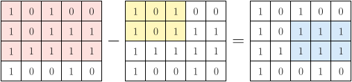
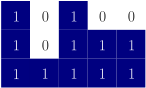
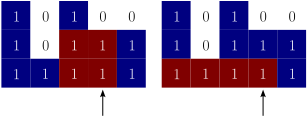

# 85. Maximal Rectangle

Given a $n\times m$ binary matrix filled with $0$’s and $1$’s, find the largest rectangle containing only $1$’s and return *its area*.

 
**Example:**


> **Input:** `matrix = [["1", "0", "1", "0", "0"], ["1", "0", "1", "1", "1"], ["1", "1", "1", "1", "1"], ["1", "0", "0", "1", "0"]]`
> 
> **Output:** `6`
> 
> **Explanation:** The maximal rectangle is shown in the above picture..


## Monotonic stack

### Motivation

I first thought this can be solved by DP: if we have a rectangle with bottom right corner ending at $(i, j)$, can we somehow relate points like $(i, j + 1)$ or $(i + 1, j)$ to it? However, whether we can make a already existing rectangle bigger depends on its shape, so DP (, at least this type of DP,) doesn't work.

Then I thought it can be solve by prefix sum. For example, <font color="#D6E9FA">blue</font> can be computed as <font color="FDE0DD">red</font> minus <font color="#FFF7BC">yellow</font>. However this is still $O((nm)^2)$ and may get TLE.[^prefix sum]

[^prefix sum]: Prefix sum does work, if we optimise it a bit. See [https://leetcode.com/problems/maximal-rectangle/solutions/5016427/solution-swift-prefix-sum-o-n-2-m](https://leetcode.com/problems/maximal-rectangle/solutions/5016427/solution-swift-prefix-sum-o-n-2-m) and [https://leetcode.com/problems/maximal-rectangle/solutions/2130637/c-easy-brute-force](https://leetcode.com/problems/maximal-rectangle/solutions/2130637/c-easy-brute-force).



Now considering rectangle as "width times height" seems a dead end. A natural alternative is "integral": accumulate the "columns" to get the area.[^similar intuition] For example, when we are at the second row, we are literally facing the below "hill".

[^similar intuition]: The "integral" intuition is very common, e.g. [LC42](https://leetcode.com/problems/trapping-rain-water) and [LC84](https://leetcode.com/problems/largest-rectangle-in-histogram)

</image>

To do the "integration", we go from the zero-th col., and move col. by col. That is, the $\text{d}x$ in $\displaystyle area = \int_i^j f(x) \text{d}x$ is a col. However, it's still not clear what is $f(x)$. E.g., when we are at the third col., both (and potentially more) <font color="#800000">rectangles</font> are valid choices, which one should we pick?

</image>


### Monotonic stack

The height $f(x)$ of the rectangle is determined by the minimum height between $i$ and $j$. $height_j$ is known: how many one's we have in col. $j$, which is $2$ here. If we brute force all possible $i$’s, the possible $height_i$’s are:

| $i$ | $j$ | $height_i$ | $height_j$ | $f(x)$ | $j - i$ | $area$ |
|-----|-----|------------|------------|--------|---------|--------|
| $0$ | $3$ | $3$        | $2$        | $1$    | $4$     | $4$    |
| $1$ | $3$ | $1$        | $2$        | $1$    | $3$     | $3$    |
| $2$ | $3$ | $3$        | $2$        | $2$    | $2$     | $4$    |
| $3$ | $3$ | $2$        | $2$        | $2$    | $1$     | $2$    |

Brute force is doable at $O(m^2)$ for each row. To optimise it, can we not try any $i$’s, but just in constant time tell which $i$ gives the best area for a given $j$? Due to the nature that $f(x)$ is determined by the shortest height, we can: whenever we see a shorter height at $j$, the previous taller height can no longer make a rectangle ending $j$, as $height_j$ is shorter. For example, here we have heights $3, 1, 3, 2, 2$:

1. first see $3$. Fine
1. now we see $1$, and $1 < 3$, so we know the previous $3$ can no longer make the width here. So $3\times 1$ is a candidate answer. Now knock $3$ out, as no matter what we see later, the height is determined by the $1$ here
1. next we see $3$, which is larger than $1$, so the previous $1$ can still make it here. We also need to keep $3$ since we may get many other $3$’s or even taller heights later
1. next we see $2$. Again, $3$ can not make it here, so a candidate answer is $3\times 1$. $1$ is fine to continue
1. next we see the final element $2$. Good, both $2$ and $1$ can make it
1. finally, we know $2$ and $1$ can both make their ways towards the last col. Height $2$ makes a rectangle from third to last col., giving a candidate answer $2\times 3$. $1$ can make from the beginning to the end, as there is no other element shorter than $1$ (otherwise we will keep it before it),  giving another candidate answer $1\times 5$

This is essentially a monotonically (weakly) increasing stack. We maintain a stack of heights, and if we see a shorter height, the previous taller height's rectangle stops right before this shorter height; we can drop the previous taller height, as the current shorter height is short than it, so whatever future heights are, it won't be a height for them, and update the answer. If we see a taller height, we keep it, as all previous heights, which are shorter than this taller height by definition of a increasing stack, can make their way here. One note is, after we visit all cols., we have to check if the stack is empty, for cases like some rectangle can make from the zero-th col. to the last, just like the above example.

```cpp
int maximalRectangle(vector<vector<char>>& matrix) {
    int n = matrix.size();
    int m = matrix[0].size();
    vector<int> h(m, 0);

    int ans = 0;
    int height;
    int width;
    for (int i = 0; i < n; i++) {
        stack<int> s;
        for (int j = 0; j < m; j++) {
            h[j] = (matrix[i][j] == '1') ? h[j] + 1 : 0;

            while (!s.empty() && h[j] < h[s.top()]) {
                height = h[s.top()];
                s.pop();
                width = s.empty() ? j : j - s.top() - 1;
                ans = max(ans, width * height);
            }
            s.push(j);
        }
        while (!s.empty() && h[s.top()] > 0) {
            height = h[s.top()];
            s.pop();
            width = s.empty() ? m : m - s.top() - 1;
            ans = max(ans, width * height);
        }
    }

    return ans;
}
```

**What Is `h`?** We count how many continuous one's we have, ending at the current row, in a DP fashion: if the current cell is one, add one to the height of the above row. If the current cell is zero, then no height at all.

**What Is `width`?** We first take the previous taller height; that's clear. The leftmost this height can make is its previous shorter height, which is the next element in the stack. If nothing else is in the stack, by definition of an increasing stack, all previous cols. have a taller height, so this height can make all the way to the previous col. of $j$, which is $j - 1$. So the `width` is from col. $0$ to $j - 1$. If there is still something $k$ left in the stack, this is the previous shorter height, again by definition. Now we know current height $j$ is the next shorter height, and $k$ is the previous shorter height, so `width` is from $k + 1$ to $j - 1$.

**Check If Stack Is Empty.** As said above, after visiting all cols., check the remaining heights in stack, as those heights can make all the way to the last col.
