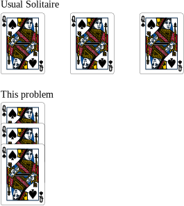

# 300. Longest Increasing Subsequence

Given an integer array `nums`, return <i>the length of the longest <b>strictly increasing</b> subsequence[^1]</i>.

[^1]: A **subsequence** is an array that can be derived from another array by deleting some or no elements without changing the order of the remaining elements.

**Example:**

> **Input:** `nums = [6, 3, 5, 10, 11, 2, 9, 1, 13, 7, 4, 8, 12]`
> 
> **Output:** `5`
> 
> **Explanation:** The longest increasing subsequence is `[3, 5, 7, 8, 12]` or `[3, 5, 10, 11, 12]`, therefore the length is 5.


## Brute force + DP

It's actually very hard to brute force. Say we simply loop from left to right in $\{6, 3, 5, 10, 11, 2, 9, 1, 13, 7, 4, 8, 12\}$, and see if we can find a longer LIS with each number. When the current number is $10$, how can we know whether $\{3, 5, 10, \ldots\}$ or $\{3, 5, 7, \ldots\}$ or other later larger numbers makes a longer LIS? Or to put differently, when we see a larger number, we may or may not want to pick it. The only way is to try both and see which gives longer LIT. This naturally gives a recursion structure: if $8$ is the number under consideration, then we check all numbers before. E.g., for number $10$ we have $\{3, 5, 10\}$, and $8$ cannot make it any longer. For number $4$, we have $\{1, 4\}$ and now can have $\{1, 4, 8\}$. For number $7$, we have $\{3, 5, 7\}$, and adding $8$ gives $\{3, 5, 7, 8\}$. We take the longest of all such check results.

Formally, call the input array `nums` = $\{a\}_i = \{a_0, a_1, \cdots, a_{n - 1}\}$. Say we are now at the $i$<sup>th</sup> number $a_i$. Let the length of LIS ending with $a_i$ be $dp(i)$. 

* base case: $dp(\cdot) = 1$, i.e. a number of its own is a length-one LIS
* recurrence relation: $\displaystyle dp(i) = \max_{j: a_i > a_j, j < i} dp(j) + 1$, i.e. for all numbers smaller than the $i$<sup>th</sup> number and before the $i$<sup>th</sup> number, we find the longest LIS ending with those numbers, and then the longest LIS ending with the $i$<sup>th</sup> number is the longest LIS plus one.

DP can solve the problem bc. it has an optimal substructure. The longest LIS of the $i$<sup>th</sup> number is the longest of all LIS's of previous numbers plus one. If not, then we have a longer/shorter LIS before, which gives a longer/shorter LIS for the $i$<sup>th</sup> number. That contradicts with $dp(i)$ being the sol. to the original problem. $\blacksquare$

```c
int lengthOfLIS(int* nums, int numsSize) {
    // Base case: all numbers of its own is a length-one LIS
    int* dp[numsSize];
    for (int i = 0; i < numsSize; i++) {
        dp[i] = 1;
    }
    int prev_lis;
    int ans = 1;

    // For each number
    for (int i = 1; i < numsSize; i++) {

        // Find the longest LIS of all LIS's ending with numbers before i
        prev_lis = 0;
        for (int j = 0; j < i; j++) {
            if (nums[i] > nums[j]) {  // It needs to be increasing
                if (dp[j] > prev_lis) {
                    prev_lis = dp[j];
                }
            }
        }

        // LIS ending with i is one plus the longest LIS found above
        dp[i] = prev_lis + 1;

        // Final answer is the longest of all LIS's
        if (dp[i] > ans) {
            ans = dp[i];
        }
    }
    return ans;
}
```

Time complexity is $1 + 2 + \cdots + n - 1 = O(n^2)$, easily calc. from the above nested loop over $i$ and $j$.


## Greedy + binary search

(I really don't know how to motivate this approach...)

This approach is from [Princeton COS 423 Theory of Algo. (Spring 2013)](https://www.cs.princeton.edu/courses/archive/spring13/cos423/lectures.php), topic [Duality Warmup](https://www.cs.princeton.edu/courses/archive/spring13/cos423/lectures/LongestIncreasingSubsequence.pdf).


### Solitaire

Recall Solitaire game: deal cards $\{a\}_i = \{a_0, a_1, \cdots, a_{n - 1}\}$ into piles, such that:

* must deal cards sequentially
* place smaller card onto larger card
* can form a new pile and put a card onto it whenever you want

The target is to minimise the #. of piles. We can easily show that the problem can be solve by greedy algo.: place a card in the leftmost possible pile. If no pile is eligible, put the card onto a new pile.

[^4]

[^4]: The SVG files of cards are from [Open Source Vector Playing Cards](https://totalnonsense.com/open-source-vector-playing-cards/).


### Connect Solitaire to LIS

Next we are going to establish the connection between Solitaire and LIS.

**Bottom Card Increasing.** *If we solve Solitaire by greedy algo., at any stage, the bottom card in piles (weakly) increases from left to right.*

*Proof.* E.g., in the diagram above, the bottom cards are $\{1, 4, 7, 8, 12\}$, which is an increasing sequence. This is true not only at the end but also during the game. We can prove this by induction. The first card itself forms the first pile, which trivially satisfies this. Assume after dealing the first $n$ cards, the bottom cards $\{b\}_i$ are weakly increasing from left to right. For the $n + 1$<sup>th</sup> card, we search for the leftmost eligible existing pile.

* if there is no eligible pile, it means $a_{n + 1}\geq b_i, \forall i$. As $\{b_i, \ldots, b_n\}$ is increasing by assumption, $\{b_i, \ldots, b_n, a_{n + 1}\}$ is also an increasing sequence
* if we do find the leftmost eligible pile, let it be the $l$<sup>th</sup> pile. By eligibility, $\color{orange}{b_l} > \color{green}{a_{n + 1}}$. By leftmost, $\color{blue}{b_{l - 1}} \leq \color{green}{a_{n + 1}}$. By induction assumption, $\color{orange}{b_l} \leq \color{red}{b_{l + 1}}$. Thus we have $\color{blue}{b_{l - 1}} \leq \color{green}{a_{n + 1}} < \color{orange}{b_l} \leq \color{red}{b_{l + 1}}$. After putting $a_{n + 1}$ onto $l$<sup>th</sup> pile, the new $b_l' = \color{green}{a_{n + 1}}$, and we still have $\color{blue}{b_{l - 1}} \leq b_l' = \color{green}{a_{n + 1}} \leq \color{red}{b_{l + 1}}$, so the new $\{b\}_i$ is still increasing $\blacksquare$

This property allows us to run binary search of piles at the end.

**Weak Duality.** *In any Solitaire, the #. of piles (don't have to be the minimum #. found in the above greedy sol.) $\geq$ the length of any increasing subsequence.*

*Proof.* Observe that within a pile, the cards becomes smaller from top to bottom,[^2] and later cards come in bottom, both of which are immediate results of the rules of Solitaire. This implies that we can pick at most one card from one pile to construct an increasing subsequence. If we pick two, and they are increasing, then the second card has to be on the top of the first card. However, the top cards come earlier in $\{a\}_i$, which means the second card is ahead of the first card in the array, which cannot be a subsequence. Contradiction. $\blacksquare$

[^2]: I call the geometrically top card "top". That is, in the first pile, $6$ is the top card and $1$ is the bottom card. Most people would say the physically top card $1$ "top". This note here is to avoid confusion.

E.g., we pick $\color{red}{10}$ and $\color{blue} 7$ in the third pile. They have to be $\{\color{blue}{7}, \color{red}{10}\}$ in order to be an increasing subsequence. However, in the input array, it's $\{\ldots, 5, \color{red}{10}, 11, \ldots, 13, \color{blue}{7}, 4, \ldots\}$.


**Strong Duality.** *Minimum #. of piles equals the length of LIS, and the greedy algo. finds both* (Hammersley [1972](https://books.google.ch/books?hl=en&id=z52wqk3KZmAC&pg=PA345)).[^6]

[^6]: Hammersley, John M. 1972. "A Few Seedlings of Research." In *Proceedings of the Sixth Berkeley Symposium on Mathematical Statistics and Probability*, Vol. 1, edited by Lucien Marie Le Cam, Jerzy Neyman, Elizabeth L. Scott, 345--94. Berkeley and Los Angeles, CA: University of California Press.

*Proof.* Whenever we place a card in greedy algo., we place it onto the leftmost possible pile. Moreover, let's also store (a pointer to) the bottom card of the left pile to the leftmost possible pile with this card. Then for all cards from the second pile rightwards, they will have a pointer pointing to some card in the left piles. Furthermore, the pointer must be pointing to a smaller card, bc. otherwise we can put the card onto the pointing card, not the current leftmost pile. Then following the pointers we can find an increasing subsequence, whose length equals the #. of piles.[^3]

[^3]: Any card in the rightmost pile is able to (indirectly) point to the leftmost pile in the end, bc. any card after the first pile will have a pointer.

By weak duality, we know the length of any increasing subsequence cannot be greater than the #. of piles, and now we find an increasing subsequence whose length is exactly the #. of piles. That must be LIS. $\blacksquare$

[^5]

[^5]: The arrow SVG is from [Wikipedia](https://upload.wikimedia.org/wikipedia/commons/d/df/Two_Parallel_lines.svg).

E.g., when we place $8$, we place it onto $11$, and the left pile is $\{10, 9, 7\}$, so $8$ points to $7$. Before, when we place $7$, the bottom of the left pile is $5$, so $7$ points to $5$, etc.

### Implementation

Now the implementation is trivial: for each card, binary search the leftmost possible pile and place it. The #. of piles is the answer.

```c
int binary_search(int* piles, int pilesSize, int target) {
    int l = 0;
    int r = pilesSize - 1;
    int mid = (l + r) / 2;

    // Check if the target is larger than the rightmost pile's bottom card,
    // i.e. check if we need to create a new pile
    if (target > piles[r]) {
        return pilesSize;
    }

    int mid_card;
    while (l < r) {
        mid = (l + r) / 2;
        mid_card = piles[mid];
        if (mid_card == target) {  // See notes below
            return mid;
        }
        else if (mid_card < target) {
            l = mid + 1;
        } else {
            r = mid;
        }
    }
    return r;
}

int lengthOfLIS(int* nums, int numsSize) {
    // Solitaire
    int piles[numsSize];   // Array to store the smallest/bottom card in piles
    piles[0] = nums[0];    // Put the first card onto the very first pile
    int n_piles = 1;
    int card;
    int leftmost_pile;
    for (int i = 1; i < numsSize; i++) {
        card = nums[i];
        
        // Find the leftmost possible pile for the given card
        leftmost_pile = binary_search(piles, n_piles, card);
        piles[leftmost_pile] = card;  // Update the bottom card in this pile

        // Check whether we've created a new pile
        if (leftmost_pile >= n_piles) {
            n_piles++;
        }
    }
    return n_piles;
}
```

**A Slightly Different Solitaire.** Note that in usual Solitaire we can't put $4$ onto $4$, but here we should. E.g., for a given input `nums = [12, 12, 12]`, there are three LIS's of length one, all of which are $\{12\}$, as LIS shall be **strictly** increasing. So the corresponding Solitaire piles shall be one single pile with three Queen's. As a result, we have a slightly modified binary search above.


