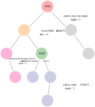

# 2385. Amount of Time for Binary Tree to Be Infected

You are given the `root` of a binary tree with **unique** values, and an integer `start`. At minute `0`, an **infection** starts from the node with value `start`.

Each minute, a node becomes infected if:

* The node is currently uninfected.
* The node is adjacent to an infected node.

Return *the number of minutes needed for the entire tree to be infected*.

**Example:**

> **Input:** `root = [1, 5, 3, null, 4, 10, 6, 9, 2], start = 3`
>
> **Output:** `4`
>
> **Explanation:** The following nodes are infected during:
>
> - Minute 0: Node $3$
> 
> - Minute 1: Nodes $1$, $10$ and $6$
> 
> - Minute 2: Node $5$
> 
> - Minute 3: Node $4$
> 
> - Minute 4: Nodes $9$ and $2$
> 
> It takes 4 minutes for the whole tree to be infected so we return `4`.

## Convert to graph and BFS

The answer is the dist. from the start node `start` to the farthest node. If the input is a graph, we can easily get this dist. from BFS.

Now the problem is how to convert a tree to an undirected graph. It's straightforward: start from root, get all its neighbour nodes, save them to the edge list/adjacency matrix. And repeat the same for the neighbour nodes, until we finish the input tree. Then run a usual BFS shall solve the problem. This approach traverse the tree/graph twice, and is thus $O(n)$. I will skip the code here as the second approach is almost twice faster.

## DFS

During the above tree-to-graph conversion, we can actually save one additional info.: have we seen the start node already? With this info., we are able to know if the current node is above (blue) or under (yellow) the subtree starting from `start`. The answer is the depth of the yellow subtree under `start`, or the dist. from `start` to `root` and `root` plus the depth of the subtree that does not contain `start`. That allows us to calc. the dist. without having to traversing again.

To formalise the idea, say we are current at node `node`:

1. check whether we have reached the end of the tree:
    * if `node` is `None`, we already reach the end of the tree, so *return* `0`, as there is no subtree under this node
    * else, DFS through the left and right subtrees
1. check if the current `node` is the `start` node:
    * if the current `node` is `start` (we are at the green node), then the DFS in step 1 simply finds the depth of the blue subtree(s) under the `start` node. So here the candidate answer is green to blue
        + this depth may or may not be the final answer, as the depth elsewhere can be deeper, so let's save it for now
        + we should *mark* that we already find the `start` node, and thus we know our position relative to `start` in any further DFS going through this node
        + we should *return* `0`, **as if we reach the end of the tree**. Bc. we only need three things:
            1. the depth of the blue subtree(s) under `start`, which we already use to update the answer above
            2. the dist. from `start` to `root`. To compute this, the DFS shall run **as if `start` is the end of the tree**, so we *return* `0` as if we are in step 1
            3. the depth of the subtree does not contain `start`, which has nothing to do here as we are currently at `start`
1. check if we are above the subtree under `start`. This check is possible bc. we store the info. on whether we've found the `start` in step 2
    * if the current `node` is not `start`, but we have already found the `start` in the DFS in step 1 (we are at the orange node), then we must be above the blue subtree under `start`, and `start` is either in the left or right subtree under `node`. The candidate answer will be pink to orange to green
    * here we *return* the dist. to `start`, bc. we've already found `start`, and thus the DFS shall run as if `start` is the end of the tree
    * why don't we need the depth of the pink subtree under `node` that does not contain `start`? Bc. we already update the answer with this depth above, and any later DFS won't need this depth, as to infect the pink subtree, `start` first goes to the current `node`, and then move to the other subtree. This path is used only once and all parents are totally unrelated
    * also keep *marking* that we've found the `start` node
1. if we haven't find `start` node, then simply *return* the deeper of the two DFS in step 1

