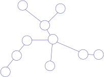
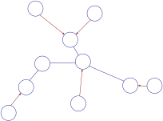
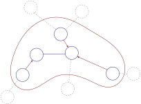
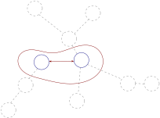

# 310. Minimum Height Trees

A tree is an undirected graph in which any two vertices are connected by exactly one path. In other words, any connected graph without simple cycles is a tree.

Given a tree of $n$ nodes labelled from $0$ to $n - 1$, and an array of $n - 1$ `edges` where <code>edges[i] = [a<sub>i</sub>, b<sub>i</sub>]</code> indicates that there is an undirected edge between the two nodes $a_i$ and $b_i$ in the tree, you can choose any node of the tree as the root. When you select a node $x$ as the root, the result tree has height $h$. Among all possible rooted trees, those with minimum height (i.e. $\min (h)$) are called **minimum height trees** (MHTs).

Return *a list of all __MHTs'__ root labels*. You can return the answer in **any order**.

The **height** of a rooted tree is the number of edges on the longest downward path between the root and a leaf. 

 
**Example:**


> **Input:** `n = 4`, `edges = [[1, 0], [1, 2], [1, 3]]`
> 
> **Output:** `[1]`
> 
> **Explanation:** As shown, the height of the tree is 1 when the root is the node with label 1 which is the only MHT.


## Topological sorting

(I find this problem extremely hard...)

To motivate, image we have a very easy graph like $0 - 1 - 2 - 3 - 4$.[^motivation] Four edges ("linearly") connect the five nodes. It's obvious that both ends ($0$ and $4$) give very deep tree with a height of $4$, while the middle ($2$) gives the shortest tree with height $= 2$. So we want to find something like "middle" of this graph. It's very easy: fast and slow pointer, or just two pointers starting from both ends and meeting in the middle. Apparently fast and slow pointer is not a good choice, as it treats the graph as a list node, rather than using the undirected nature of the graph. So simply two pointers from both ends.

[^motivation]: From [https://leetcode.com/problems/minimum-height-trees/solutions/76055/share-some-thoughts](https://leetcode.com/problems/minimum-height-trees/solutions/76055/share-some-thoughts).

Now generalise this intuition to any graph. We want to start two (or many, depending on how many "ends" the graph has) pointers from the "end". Then we want to move pointers towards "centre". If pointers "meet", that's the answer. There are a lot of things unclear:

* end: it's straightforward to define "end" as nodes with only one degree. They seem to be the most remote nodes
* centre: if we are in the end, we don't really know how the rest of the graph looks like. So BFS. If the BFS reaches another end, kill the pointer
* meet: if the linear graph example above, we have five nodes. If we have four, pointers won't meet, but will be one node away. So here we should do the same: BFS, kill pointers going to any end, and stop until we only have two or one pointer

The graphical illustration shows this idea better: keep deleting "ends" or "leaves", which are the nodes with degree of $1$, and then update the degree for the remaining nodes after removing these leaves and edges, until we end up with only one or two leaves.[^graphic illustration]

[^graphic illustration]: From [https://leetcode.com/problems/minimum-height-trees/solutions/76055/share-some-thoughts/comments/79475](https://leetcode.com/problems/minimum-height-trees/solutions/76055/share-some-thoughts/comments/79475).

   

The implementation is trivial now.

```cpp
vector<int> findMinHeightTrees(int n, vector<vector<int>>& edges) {
    if (n == 1) return {0};

    vector<unordered_set<int>> neighbours(n);
    for (auto& e : edges) {
        neighbours[e[0]].insert(e[1]);
        neighbours[e[1]].insert(e[0]);
    }

    queue<int> leaves;
    for (int i = 0; i < n; i++) {
        if (neighbours[i].size() == 1) leaves.push(i);
    }
    int neighbour;
    while (n > 2) {
        n -= leaves.size();
        vector<int> temp;
        int n_leaves = leaves.size();
        for (int i = 0; i < n; i++) {
            int leaf = leaves.front();
            leaves.pop();
            neighbour = *neighbours[leaf].begin();
            neighbours[neighbour].erase(leaf);
            if (neighbours[neighbour].size() == 1) leaves.push(neighbour);
        }
    }
    return leaves;
}
```
