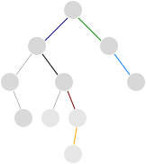

# 543. Diameter of Binary Tree

Given the `root` of a binary tree, return *the length of the __diameter__ of the tree*.

The **diameter** of a binary tree is the **length** of the longest path between any two nodes in a tree. This path may or may not pass through the `root`.

The **length** of a path between two nodes is represented by the number of edges between them.

 
**Example:**


> **Input:** `root = [1, 2, 3, 4, 5]`
> 
> **Output:** `3`
> 
> **Explanation:** $3$ is the length of the path $[4, 2, 1, 3]$ or $[5, 2, 1, 3]$.


## Two DFS

The key observation is that the answer path must start from the bottom of the left subtree of some node, going through this node, and end at the bottom of its right subtree, like the thick path below. So the answer must be the depth of left subtree plus the depth of the right subtree of some node.




**Proof by Contradiction.** Assume node $n$ is the top/highest node in the answer path. If the starting point of the answer path is not at the bottom of some subtree (no orange path in the bottom), then we can construct a longer path by start at a deeper node (add orange). We can prove the same for ending point. Therefore, the answer path must be from bottom of one subtree to some node and to the bottom of the other subtree. $\blacksquare$

We DFS through all nodes, find their depth. Then DFS again through the nodes, and for each node, add up the depth of their children. The answer is the largest one of those sums.


### Sol.

```cpp
/**
 * DFS to find each node's depth
 */
int dfs(TreeNode* node) {
    if (node == NULL) {
        return -1;
    }

    if ((node -> left == NULL) && (node -> right == NULL)) {
        node -> val = 0;  // Store the depth as the node value
        return 0;
    }

    node -> val = max(dfs(node -> left), dfs(node -> right)) + 1;
    return node -> val;
}

/**
 * DFS to add up each node's two subtree's depth
 */
void dfs_2(TreeNode* node, int& ans) {
    if (node == NULL) {
        return;
    }
    
    int temp = 0;
    if (node -> left != NULL) {
        temp += node -> left -> val + 1;  // Add the depth of left subtree
        dfs_2(node -> left, ans);         // Visit nodes in the left subtree
    }
    if (node -> right != NULL) {
        temp += node -> right -> val + 1;
        dfs_2(node -> right, ans);
    }
    ans = max(ans, temp);  // Update the final answer
    return;
}

int diameterOfBinaryTree(TreeNode* root) {
    dfs(root);
    int ans = 0;
    dfs_2(root, ans);
    return ans;
}
```

## One DFS

We don't actually need DFS for a second time. The intuition is, when DFS finds the depth of a given node, then all nodes below and their depths are all already known during the recursion, so we can already calculate the sum of depth of the two subtrees.

```cpp
int dfs(TreeNode* node, int& ans) {
    if (node == NULL) {
        return -1;
    }
    if ((node -> left == NULL) && (node -> right == NULL)) {
        return 0;
    }

    int left_depth = dfs(node -> left, ans);
    int right_depth = dfs(node -> right, ans);
    
    // Update the ans. with left subtree depth plus right subtree depth. The
    // `+2` comes from the path length of left child -> node -> right child.
    // It's fine if we have no left child, as we already assign depth = -1 for
    // NULL in the very beginning
    ans = max(ans, left_depth + right_depth + 2);
    return max(left_depth, right_depth) + 1;
}

int diameterOfBinaryTree(TreeNode* root) {
    int ans = 0;
    dfs(root, ans);
    return ans;
}
```
